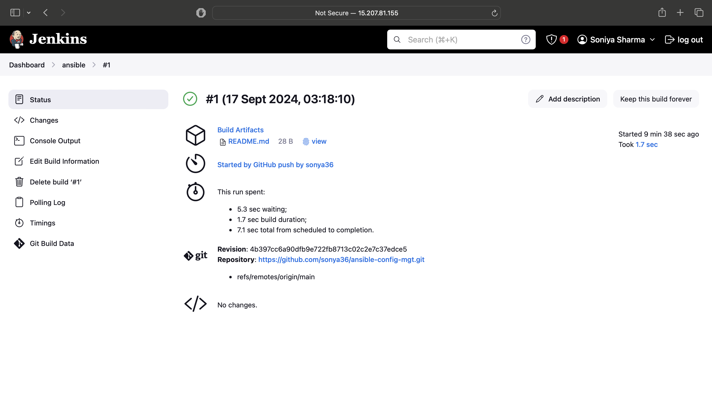
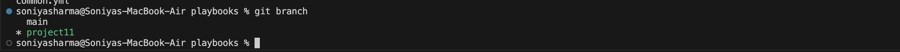
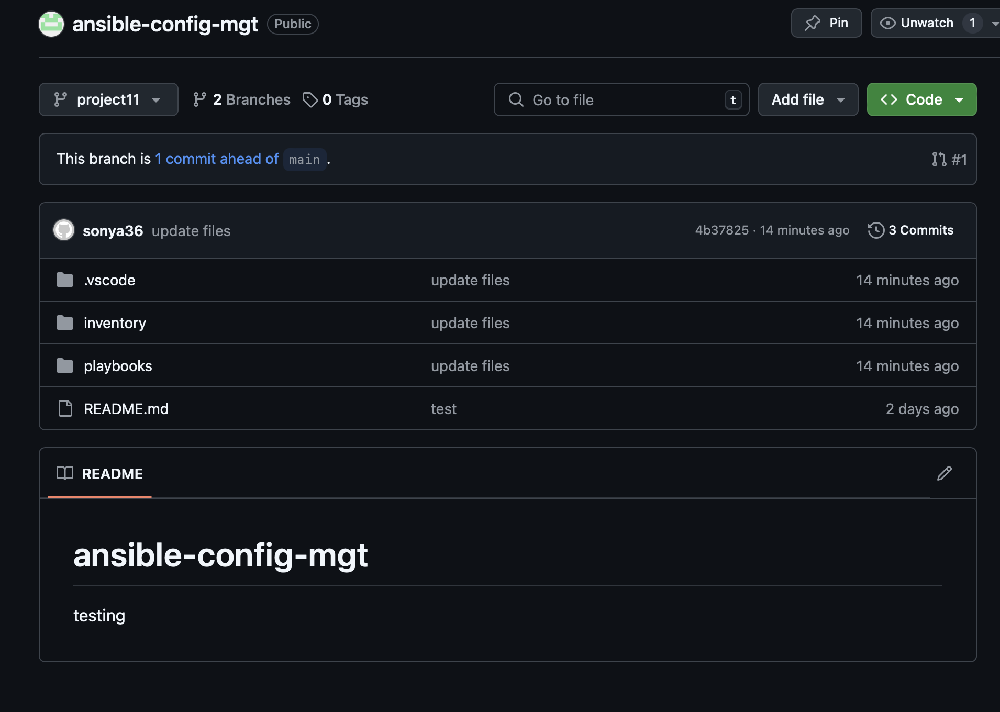

# Ansible_Configuration_Management_Automate_Project_7_10
# Ansible Installation and Configuration on EC2 with Jenkins Integration

## Step 1: Update the Name Tag of Your Jenkins EC2 Instance
1. **Go to the AWS EC2 Console:**
   - Select your Jenkins EC2 instance of project tooling website solution using jenkins .
   - Click on the "Tags" tab.
   - Edit or add a new tag with **Name**: `Jenkins-Ansible`.
   - This name tag will make it easier to identify your EC2 instance for running playbooks.
    
    
## Step 2: Create a New GitHub Repository (ansible-config-mgt)
1. **Create Repository:**
   - Log in to your GitHub account.
   - Click on the "+" icon at the top right corner and select **"New repository."**
   - Name the repository `ansible-config-mgt`.
   - Initialize the repository with a `README.md` file.
   - This repository will hold your Ansible configurations and playbooks.
   

## Step 3: Install Ansible on the EC2 Instance
1. **Connect to the EC2 Instance (Jenkins-Ansible):**
   - Use SSH to connect to your EC2 instance:
     ```bash
     ssh -i /path/to/private_key.pem ubuntu@<instance_public_ip>
     ```

2. **Update the Package List and Install Ansible:**
   - Run the following commands to update your system and install Ansible:
     ```bash
     sudo apt update
     sudo apt install ansible -y
     ```

3. **Verify the Ansible Installation:**
   - Check the Ansible version by running:
     ```bash
     ansible --version
     ```
   - Ensure that Ansible is installed and working correctly.

## Step 4: Configure Jenkins Build Job for the ansible-config-mgt Repository
1. **Create a Freestyle Project in Jenkins:**
   - Go to your Jenkins dashboard and click on **New Item**.
   - Name your new project `ansible` and choose **Freestyle project**.

2. **Source Code Management:**
   - In the configuration settings, under **Source Code Management**, select **Git** and point it to your GitHub repository (`ansible-config-mgt`):
     ```bash
     https://github.com/<your_username>/ansible-config-mgt.git
     ```
   - Make sure to set the branch to `main` or `master` depending on your repository's default branch.
   
3. **Configure Webhook in GitHub:**
   - In your GitHub repository, go to **Settings > Webhooks** and click on **Add webhook**.
   - Set the **Payload URL** to your Jenkins URL:
     ```bash
     http://<jenkins_server_ip>:8080/github-webhook/
     ```
   - Set the **Content type** to `application/json`.
   - Choose to send the webhook for **"Just the push event"** to trigger the build when changes are pushed.
    
4. **Post-Build Actions:**
   - In the Jenkins project configuration, under **Post-build Actions**, set it to archive all files (**). This saves the build artifacts in the following location:
     ```bash
     /var/lib/jenkins/jobs/ansible/builds/<build_number>/archive/
     ```
    
   

## Step 5: Test the Setup
1. **Edit the README.md file:**
   - Make a small change to the `README.md` file in the main (master) branch of your `ansible-config-mgt` repository.

2. **Push the Change:**
   - Commit and push the change to the repository.

3. **Trigger the Build Automatically:**
   - Check if the webhook triggers the build in Jenkins automatically.
   - Verify that the build artifacts are saved in the following directory:
     ```bash
     ls /var/lib/jenkins/jobs/ansible/builds/<build_number>/archive/
     ```
    
    
## Step 6: Elastic IP for Jenkins-Ansible EC2 Instance
1. **Allocate Elastic IP:**
   - Go to the AWS EC2 Console.
   - In the left menu, under **Network & Security**, click on **Elastic IPs**.
   - Allocate a new Elastic IP and associate it with your `Jenkins-Ansible` EC2 instance.

2. **Update Webhook with the Elastic IP:**
   - After assigning the Elastic IP, update the GitHub webhook with the new Jenkins server IP to ensure continuity even if the EC2 instance restarts.


3. **Release the Elastic IP:**
   - If you terminate your EC2 instance, make sure to release the Elastic IP to avoid unnecessary charges.

# Preparing Your Development Environment Using Visual Studio Code (VS Code)

## Step 1: Install Visual Studio Code (VS Code)
- Download and install VS Code from [here](https://code.visualstudio.com/). 
- It is a free, open-source code editor suitable for various languages, including configuration management with Ansible.

## Step 2: Install Remote Development Extension
- In VS Code, navigate to the **Extensions** tab (or press `Ctrl+Shift+X`) and search for **Remote Development**. 
- Install the extension to allow you to work with remote files on your `Jenkins-Ansible` server.


## Step 3: Connect to GitHub
- Open VS Code and configure it to connect to your GitHub account by cloning your newly created `ansible-config-mgt` repository.
- Open the **Command Palette** (`Ctrl+Shift+P`) and select **Clone Repository**.
- Paste the URL of your `ansible-config-mgt` repository from GitHub.

## Step 4: Clone Your Repository to Jenkins-Ansible Instance
- On your `Jenkins-Ansible` EC2 instance, you can either clone the repository using:
```
  git clone <your-ansible-config-mgt-repo-link>
```

# Steps to Begin Ansible Development

## Step 1: Create a New Branch in GitHub
- In your `ansible-config-mgt` GitHub repository, create a new branch dedicated to feature development.
- Use a descriptive branch name like `project11` to represent a specific task or project.
```
    git checkout -b project11
```


## Step 3: Set Up Directory Structure

- Create a playbooks directory:
- This will store all your Ansible playbook files.
```
mkdir playbooks
```
- Create an inventory directory:
This will be used to keep your hosts organized by environment.
```
mkdir inventory
```

## Step 4: Create Your First Playbook

- In the playbooks folder, create a new playbook called common.yml, which will define the basic tasks that are common across all environments.
```
touch playbooks/common.yml
```
## Step 5: Create Inventory Files for Each Environment

- Within the inventory folder, create separate inventory files for different environments like dev, staging, UAT, and prod. Each file should represent a specific environment.
```
touch inventory/dev.yml
touch inventory/staging.yml
touch inventory/uat.yml
touch inventory/prod.yml
```

- An Ansible inventory file organizes your servers into groups, making it easier to apply playbooks. You can create a development inventory file by saving the following structure into inventory/dev.yml. Update the IP addresses and usernames to match your environment.
Here, I convert .yml inventory file to .ini to use below code.

```
    [nfs]
    <NFS-Server-Private-IP-Address> ansible_ssh_user='ec2-user'

    [webservers]
    <Web-Server1-Private-IP-Address> ansible_ssh_user='ec2-user'
    <Web-Server2-Private-IP-Address> ansible_ssh_user='ec2-user'

    [db]
    <Database-Private-IP-Address> ansible_ssh_user='ec2-user'

    [lb]
    <Load-Balancer-Private-IP-Address> ansible_ssh_user='ubuntu'
```


- To connect Visual Studio Code (VS Code) on macOS to manage a Jenkins-Ansible EC2 instance setup, you can follow these steps:

1. **VS Code Installed**: Ensure that Visual Studio Code is installed on your macOS.
2. **SSH Access to EC2**: You should have SSH access to your EC2 instance, including the `.pem` key file used to authenticate the connection.
3. **Jenkins & Ansible Setup**: Jenkins and Ansible should already be installed and configured on your EC2 instance.

#### 1. Install VS Code Extensions
First, install the necessary VS Code extensions for remote development and Ansible management:
- **Remote - SSH**: Allows you to open a remote terminal and work directly on your EC2 instance.
- **Ansible Extension**: Provides syntax highlighting, snippets, and linting for Ansible files.
  
To install them:
1. Open **VS Code**.
2. Go to the **Extensions** tab (or press `Cmd+Shift+X`).
3. Search for **Remote - SSH** and install it.
4. Search for **Ansible** and install it.

#### 2. Configure SSH in VS Code
1. Open the VS Code command palette by pressing `Cmd+Shift+P`.
2. Type `Remote-SSH: Open SSH Configuration File...`.
3. Select the appropriate SSH configuration file (likely `~/.ssh/config`).
4. Add a new entry for your EC2 instance:

   ```plaintext
   Host jenkins-ansible-instance
     HostName <EC2_Public_IP>
     User ec2-user 
     IdentityFile ~/.ssh/config/your-key.pem
   ```

   Replace `<EC2_Public_IP>` with your EC2 instance's public IP and `your-key.pem` with the path to your SSH key file.


#### 3. Connect to EC2 via SSH in VS Code
1. Open the command palette (`Cmd+Shift+P`).
2. Type `Remote-SSH: Connect to Host...` and select your configured EC2 instance (`jenkins-ansible-instance`).
3. Once connected, VS Code will open a new window, allowing you to access files and run commands directly on the EC2 instance.


- Ansible Common Playbook: This Ansible playbook is designed to perform common tasks across web, NFS, database, and load balancer servers in the infrastructure. The playbook includes tasks to ensure Wireshark is installed, create directories and files, change the system timezone, and run shell scripts.

## Playbook Structure

### Update Web, NFS, and Database Servers (RHEL 8)
```
---
- name: Common configuration for all servers
  hosts: all
  become: yes
  
  tasks:
    - name: Update and upgrade package list for RedHat-based systems
      yum:
        name: '*'
        state: latest
      when: ansible_os_family == "RedHat"

    - name: Update the package cache for Debian-based systems
      apt:
        update_cache: yes
        cache_valid_time: 86400
      when: ansible_os_family == "Debian"
    
    - name: Ensure Wireshark is installed at the latest version
      package:
        name: wireshark
        state: latest
    
    - name: Create a directory at /opt/example
      file:
        path: "/opt/example"
        state: directory
        owner: root
        group: root
        mode: '0755'
  
    - name: Set the server timezone to UTC
      timezone:
        name: UTC

    - name: Execute a custom script via Bash
      shell: /path/to/script.sh
      args:
        chdir: /path/to
        executable: /bin/bash
```


# Updating Git with Latest Code and Creating a Pull Request (PR)

Update your GitHub repository with the latest changes, create a pull request, review the changes, and merge the branch into the master branch. Finally, Jenkins will automate the build and save artifacts.

## Steps for Pushing Code to GitHub

### 1. Check Git Status
Before committing any changes, check the status of your Git repository to see which files have been modified or are new.
```
git status
```

### 2. Add Files to Staging
Select the files you want to commit by using the `git add` command. You can either add specific files or use `.` to add all changes.
```
git add <selected files>
```
To add all changes:
```bash
git add .
```

### 3. Commit the Changes
Commit the staged files with a descriptive commit message.
```bash
git commit -m "Descriptive commit message"
```

### 4. Push the Changes to GitHub
Once the changes are committed, push them to the remote branch on GitHub.
```
git push origin <your-branch-name>
```

## Creating a Pull Request (PR)

### 1. Navigate to GitHub
Go to your repository on GitHub and locate the **Pull Requests** tab.

### 2. Create a New Pull Request
Click on **New Pull Request** and select the branch you just pushed from the dropdown menu. Ensure you are comparing it against the `master` branch.

### 3. Review and Submit the PR
Review the changes in the PR, add any necessary comments, and submit the pull request for peer review.

## Code Review

### 1. Acting as a Reviewer
Pretend you're another developer and review the code changes in the PR. Look for any errors, improvements, or issues with the new feature.

### 2. Approving the PR
If you are satisfied with the changes, approve the PR and leave comments if necessary.

### 3. Merging the PR to Master
Once the PR is approved, merge the branch into the `master` branch by clicking the **Merge Pull Request** button on GitHub.

## Synchronizing with Master Branch

### 1. Checkout to Master
Switch back to the master branch locally by using the `git checkout` command.
```bash
git checkout master
```

### 2. Pull Latest Changes from Master
After merging the PR, pull down the latest changes to your local machine.
```bash
git pull origin master
```

## Jenkins and Build Artifacts

Once your code is merged into the master branch, Jenkins will trigger a build automatically. The build process will:

1. Compile the project.
2. Save the build artifacts.

The build artifacts are stored in:
```bash
/var/lib/jenkins/jobs/ansible/builds/<build_number>/archive/
```

This directory on the Jenkins-Ansible server contains the results of the build.

## Conclusion

Following these steps will ensure a smooth workflow from coding to pushing changes, creating PRs, and automating builds with Jenkins. The **Four Eyes Principle** ensures code quality through peer review before deployment.





# Running Your First Ansible Playbook Test

Now that you've created your first Ansible playbook, it's time to run the playbook and verify that everything works as expected. Follow these steps to execute the playbook and confirm successful deployment.

## 1. Navigate to Ansible Configuration Directory
First, navigate to the directory where your Ansible configuration files are stored.
```
cd ansible-config-mgt
```

## 2. Execute the Ansible Playbook
Run the `ansible-playbook` command to execute the `common.yml` playbook. Make sure to specify the inventory file `inventory/dev.yml` that contains your servers.
```
ansible-playbook -i inventory/dev.ini playbooks/common.yml
```

This command will:
- Access the inventory defined in `dev.ini`.
- Execute the tasks in `playbooks/common.yml`.

### Example Output
You should see output similar to the following:


## 3. Verify Installation

After the playbook completes, you can verify that Wireshark has been installed by logging into each server and running the following command:

### Check Wireshark Installation on Each Server
#### NFS Server
```bash
which wireshark
wireshark --version
```

#### Webserver 1
```bash
which wireshark
wireshark --version
```


#### Webserver 2
```bash
which wireshark
wireshark --version
```

#### Load Balancer (LB) Server
```bash
which wireshark
wireshark --version
```

#### Database (DB) Server
```bash
which wireshark
wireshark --version
```


Each of these commands should confirm the installation of Wireshark on the respective server.

## 4. Ansible Architecture Overview

Congratulations! Your updated architecture now looks like this:

- **Web Servers**: Wireshark installed and verified.
- **NFS Server**: Wireshark installed and verified.
- **Load Balancer**: Wireshark installed and verified.
- **Database Server**: Wireshark installed and verified.

## 5. Optional Step: Repeat the Process

To further solidify your knowledge and see how easily you can manage a fleet of servers, repeat the process by making updates to your Ansible playbook. Add new tasks, go through the full Git workflow:
1. **Checkout** the code.
2. **Make changes** to your playbook.
3. **Commit** the changes.
4. **Raise a Pull Request** (PR).
5. **Merge** the PR after peer review.
6. **Run the Playbook** again.

This will help you automate and manage your servers efficiently.

## Conclusion

You’ve just automated routine tasks with your first Ansible project! This is a major step towards managing server fleets at scale. Keep practicing, as more exciting projects are ahead. 


